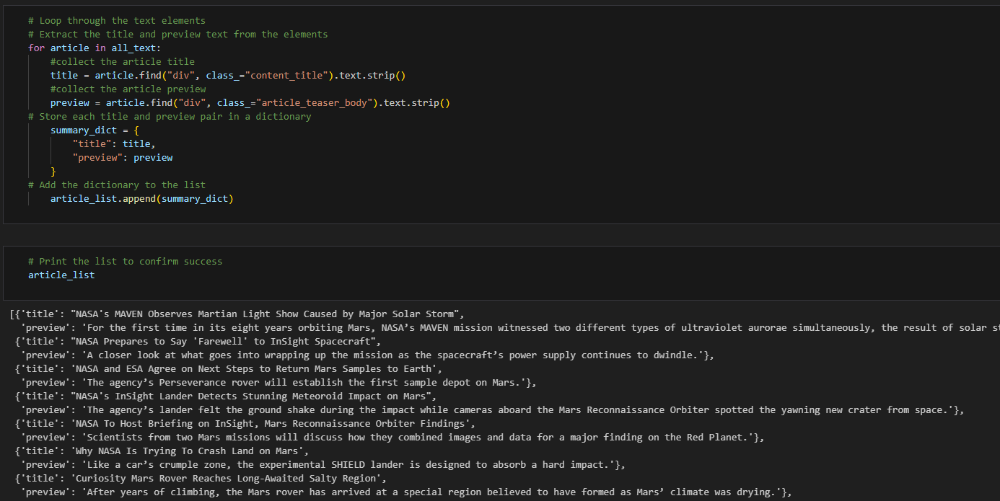
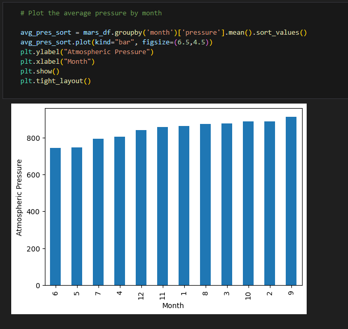

# Mars Exploration: Web Scraping & Data Analysis

# Summary:

This project explores Mars through web scraping and data analysis. Part one involves scraping titles and preview text from Mars news articles, while part two delves into analyzing Mars weather data. It utilizes automated browsing, Beautiful Soup, and Pandas to extract and analyze data, gaining insights into Mars' climate and news updates.

# Sample of Part 1 Results:

The result of extracting the preview text and news articles that were scraped. 

# Sample of Part 2 Results:

A graph showing the average pressure by month on Mars. 

# Conclusion:

Using the data I gained from webscraping, I was able to apply many different charts and calculations to it. See the files labeled part_1_mars_news.ipynb, and part_2_mars_weather.ipynb
to view the full results of this project. 

# File Information:

All solution files are located in the Starter_Code folder. 
part_1_mars_news.ipynb is the code for part 1. 
part_2_mars_weather.ipynb is the code for part 2. 